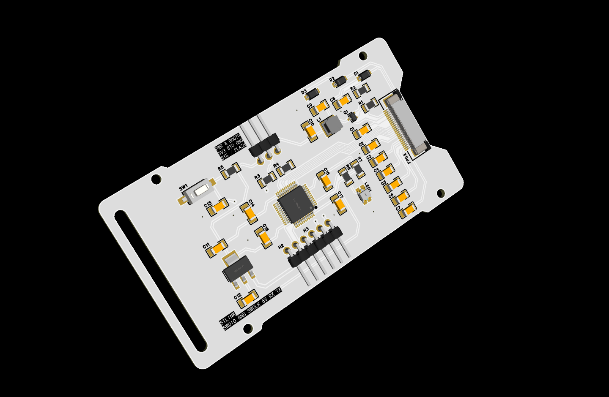

# Software
located in `./POKEINK/` 
open it via `STM32CubeIDE`
# PCB 
`./PCB/ProPrj_PocketEPD.epro` was made with EDA provided `lceda.cn`

`./PCB/Export_Altium.zip` was exported from LCEDA, but please do check if it(both schematic and layout) matchs `./PCB/Schematic.png` if you use AltiumDesigner

# Features
8x16 char/string,
lines,
progress bar(circular),
QR codes,
and circle(reuse the progress function)

Drawing can be done with scripts by running `python.exe ./pyScript/main.py`,
see `guide.txt` (the protocol) and `testCMDs` (sample commands, also the default file python script go with) for reference

params:
'-f', '--file' file to use
'-p', '--port' port if you want to specify one
'-b', '--baudrate' baudrate, 115200 by default

# TODO

# Parts
EPD https://www.good-display.cn/product/515.html