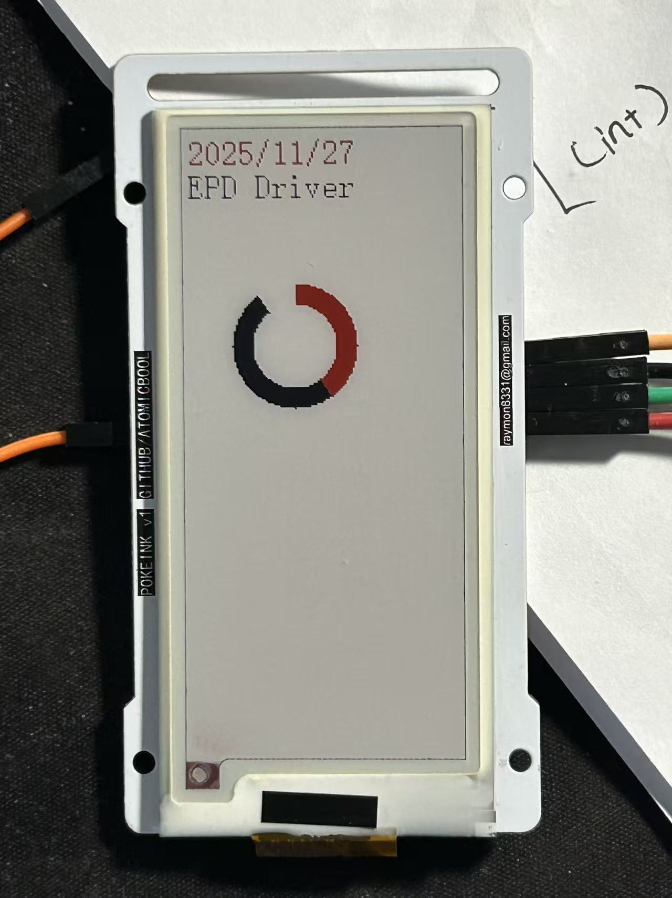

# Software
located in `./POKEINK/` 
open it via `STM32CubeIDE`
# PCB 
`ProPrj_PocketEPD_2025-11-28.epro` was made with EDA provided `lceda.cn`

`Altium_PocketEPD_2025-11-28.zip` was exported from LCEDA, but please do check if it(both schematic and layout) matchs `SCH_Main_Schematic_1-P1_2025-11-28.png` if you use AltiumDesigner

# Features
right now, it supports 8x16 english character, lines, progress bar(circular), and circle(reuse the progress function)

# TODO
1. function that interpret serial input and draw things see `currentPlan.txt`
2. drawRectangle()
3. replace the dupont connector with Pad Holes

# Parts
EPD https://www.good-display.cn/product/515.html